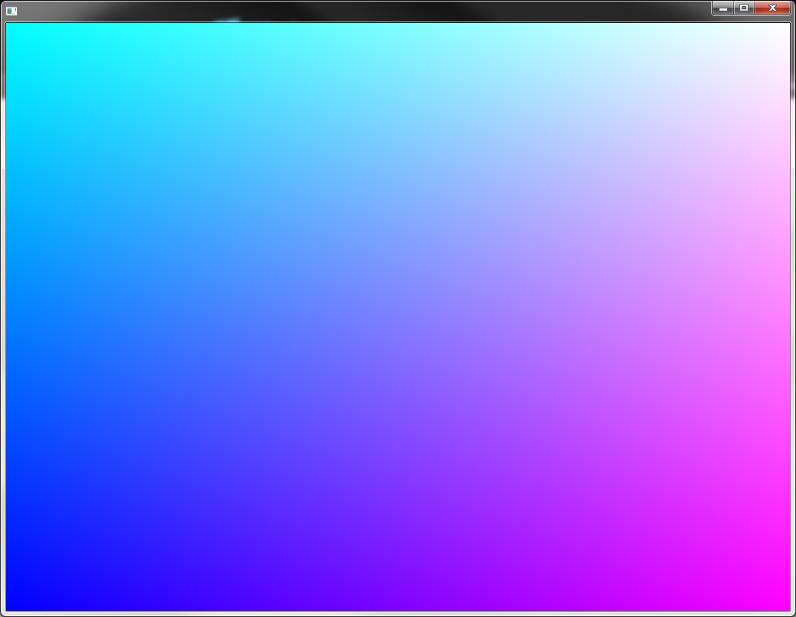
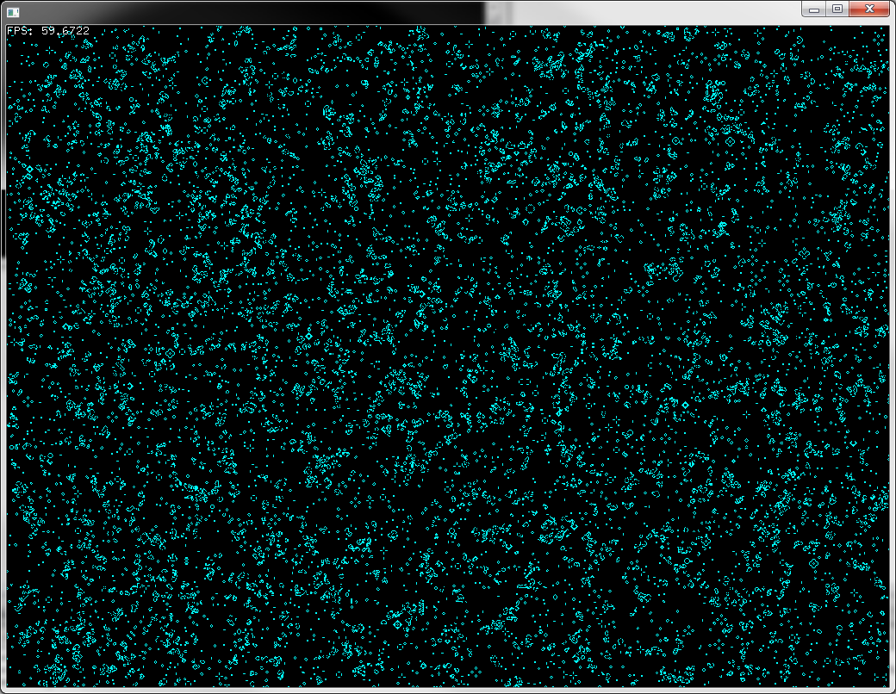
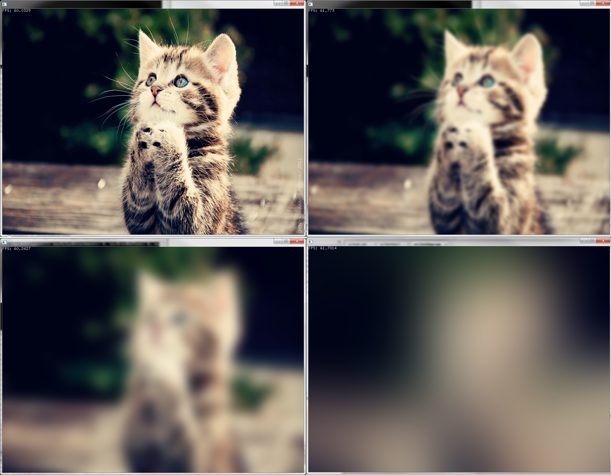

# ofShaders #

As I work through the [openFrameworks shaders tutorial](http://openframeworks.cc/tutorials/graphics/shaders.html), I'll be uploading my own heavily commented shaders.  This will eventually take the form of a more guided tutorial.

**Topics to Eventually Explain:**

- Vertices, faces, indices, normals, textures
- Vectors, matrices and geometric projections
- The mysterious rendering pipeline
- GLSL syntax
- Built-in variables from *both* openFrameworks and and GLSL
	- This was (is) a big stumbling block for me.  Jumping into code where variables are defined for you behind the scene can be pretty confusing.
- GPU for computational processing 
- When to invest the time in writing shaders
 

**Resources:**

- [openGL SIGGRAPH Talk](https://www.youtube.com/watch?v=T8gjVbn8VBk)
	- Mammoth 3-hour introductory course from 2013 
	- Nice overview of going from scratch to a complete program while also still leaving breadcrumbs that you can follow to deeper knowledge
- [Steven Wittens's 2013 Talk: Making WebGL Dance](https://www.youtube.com/watch?v=GNO_CYUjMK8)
	- Easy-to-understand coverage of what is happening on the graphics card
	- He has good coverage of rasterization, anti-aliasing, vertices
	- He's less good at explaining the linear math and shader pipeline 
- [Shaderific](http://www.shaderific.com/glsl/) 
	- Nice concise descriptions of the GLSL language
	- It is targeted for openGL ES, the embedded systems (mobile) flavor of openGL, but it is still a helpful reference.
- [openGL.org](https://www.opengl.org/wiki/Rendering_Pipeline_Overview)
	- Not always the easiest to jump into without any background, but immensely helpful reference.
- [Lighthouse3d.com](http://www.lighthouse3d.com/tutorials/glsl-core-tutorial/) 
	- If you can get past their web design, then you'll find some worthwhile tutorials

**Online Shader Galleries and Editors:**

- [GLSL Sandbox](http://glsl.heroku.com/)
- [shadertoy](https://www.shadertoy.com/)

## 01_ColorMap ##

Same as the first example from the openFrameworks shaders tutorial.  This program draws a rectangle that covers the screen, and the fragment shader colors the pixels based on their position on the screen, generating a color map: 

## 02_ConwaysGameOfLife ##

[Conway's Game of Life](http://en.wikipedia.org/wiki/Conway's_Game_of_Life) written to run in a shader:

## 03_ConwayRevisited ##

TDB, something with using applying a magnifier effect or showing off the power of shaders.  An example of running three simultaneous, independent games of life in a one rendering pass (using each color channel as a separate game):

## 04_GaussianBlur ##

TDB, something with applying Gaussian Blur.  Standard sampling techniques only allow for a small blur radius before the effect breaks down (like this [github tutorial](https://github.com/mattdesl/lwjgl-basics/wiki/ShaderLesson5)).

Since I wanted some non-realtime, high quality effects.  I wrote a script that generates the shaders on-the-fly based on the blur radius.  It will take enough samples to generate reasonably nice large blur radius effects, like:

